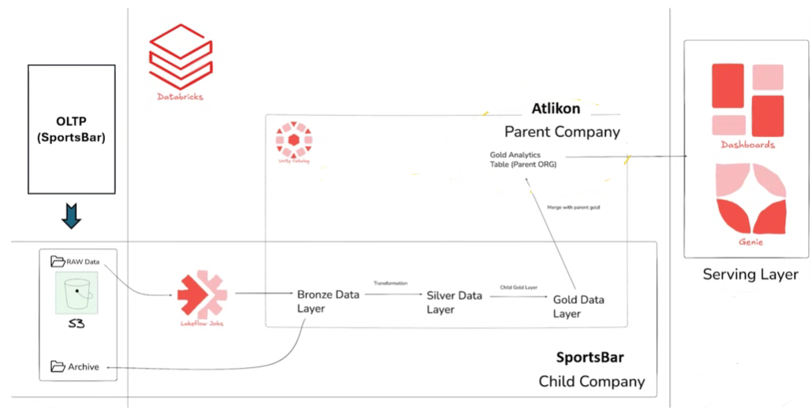
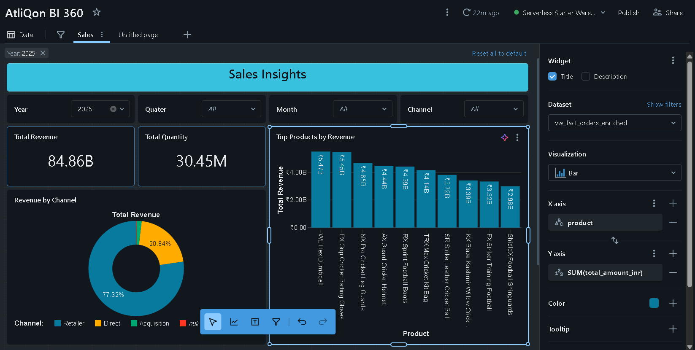

# fmcg-data-lakehouse-databricks

 Built an End-to-End Data Engineering Project: FMCG Data Lakehouse on Databricks (Atlon × Sports Bar Case Study)
I worked on a real-world FMCG scenario where a large company (Atlon) acquires a startup (Sports Bar), leading to fragmented and inconsistent data.
🔧 What I built:
• End-to-end data pipeline using Medallion Architecture (Bronze, Silver, Gold)
• Batch + Incremental processing
• Data cleaning, transformation, and schema alignment
• Star schema data model for analytics
⚙️ Tech Stack:
Databricks | AWS S3 | Python | SQL | Delta Tables
📊 Output:
• Unified analytics dashboard
• Revenue insights & product performance
• Automated data workflows using Databricks Jobs
💡 Key Learning:
Handling messy real-world data and building scalable pipelines for business analytics.

##  Architecture

##  Dashboard Output

